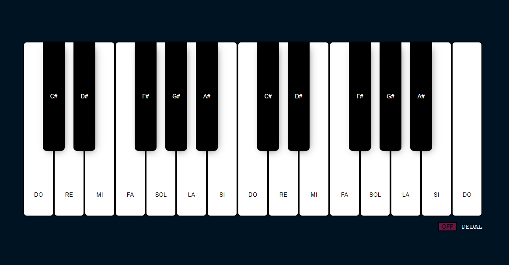

# Piano Online con React.js y Tone.js

Bienvenidos! Hice un pequeño Piano con React.js y Tone.js controlado por mouse o teclado.

## Aplicamos

- React Create Application (CRA)
- Uso de Context y Provider
- Custom Hooks
- Manejo de eventos del teclado y mouse
- Uso de la librería Tone.js

## Requerimientos

- Node >= v12.4.0
- tone v14.7.77 (obligatorio)
- webmidi v2.5.3 (obligatorio)

## Estructura de carpetas

    .
    ├── src                         # Archivos fuente
    │   ├── components              # Componentes UI
    │   ├── hooks                   # Custom hooks para el Piano y manejo de eventos
    │   ├── providers               # Proveedor de contexto del Piano
    │   ├── package.json
    │   └── README.md
    └── public                      # Assets

## Advertencias y Recomendaciones

- La descarga de las notas de Piano toma un tiempo en finalizar a pesar de que la promesa resuelve con éxito.
- Debido a lo primero mencionado, las teclas funcionan segundos después de mostrado el Piano.
- Puedes agregar más teclas y/o octavas en el archivo `src/components/Piano/octavesConfig.js`

## Autor

[zendostrike](https://gramirez.me)
